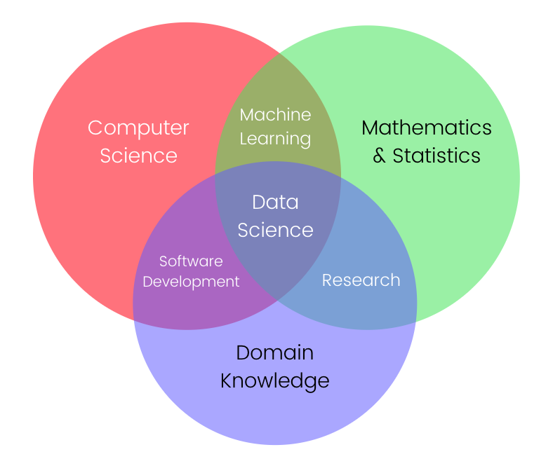

# Advanced Statistics for Data Science and Machine Learning

Welcome to the Advanced Statistics for Data Science and Machine Learning repository by Muhammad Sheraz. This repository serves as an extensive resource for mastering advanced statistics concepts tailored for applications in data science and machine learning. Whether you are a student, a data scientist, or a professional in the field, this repository is crafted to deepen your understanding and proficiency in advanced statistical methods using the Python programming language.

## Course Overview

In this repository, we will delve into advanced statistical techniques and methodologies essential for making informed decisions in data science and machine learning. From probability distributions to hypothesis testing and advanced regression models, each topic is covered with practical examples and Python implementations.

## Repository Structure

- **Lecture 1: Probability Distributions**
  - Introduction to Probability Distributions
  - Discrete and Continuous Distributions
  - Common Probability Distributions (Normal, Poisson, Binomial, etc.)

- **Lecture 2: Hypothesis Testing**
  - Foundations of Hypothesis Testing
  - One-sample and Two-sample Tests
  - Chi-Square Tests
  - ANOVA

- **Lecture 3: Advanced Regression Models**
  - Multiple Regression Analysis
  - Logistic Regression
  - Ridge and Lasso Regression
  - Polynomial Regression

## How to Use This Repository

1. Clone this repository to your local machine using `git clone`.
2. Explore the relevant lecture folders to access code, resources, and notes for each topic.
3. Review the provided code examples and run them to understand the practical implementations.
4. Utilize the content as a reference or study guide for applying advanced statistics in data science and machine learning projects.
5. Contribute, report issues, or suggest improvements to enhance the quality of this repository.

## Get in Touch

If you have questions, suggestions, or feedback, feel free to create an issue or reach out to me via email at [sheraz601050@gmail.com](mailto:sheraz601050@gmail.com).

---

## Happy Learning! 📊

I hope you find this repository instrumental in your journey to mastering advanced statistics for data science and machine learning. Explore, learn, and apply these concepts to elevate your skills in the world of data! 😄
